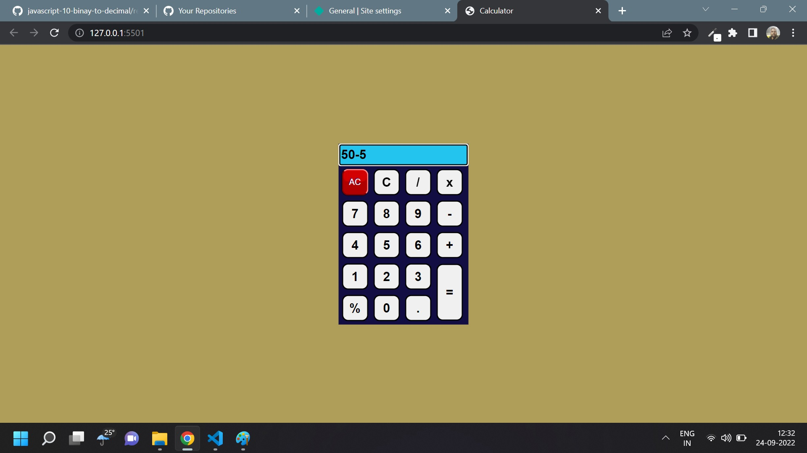

# Javascript Assignment Calculator

## Calculator [Live Link](https://basic-calculatorr.netlify.app/)

- Skills Gained in this project

  - use airthmatic operators

  - delete last value in input on click using destucturing and pop method

---

## Time taken to finish this project

- 1 hour 50 minutes to complete it

#### Screenshot

